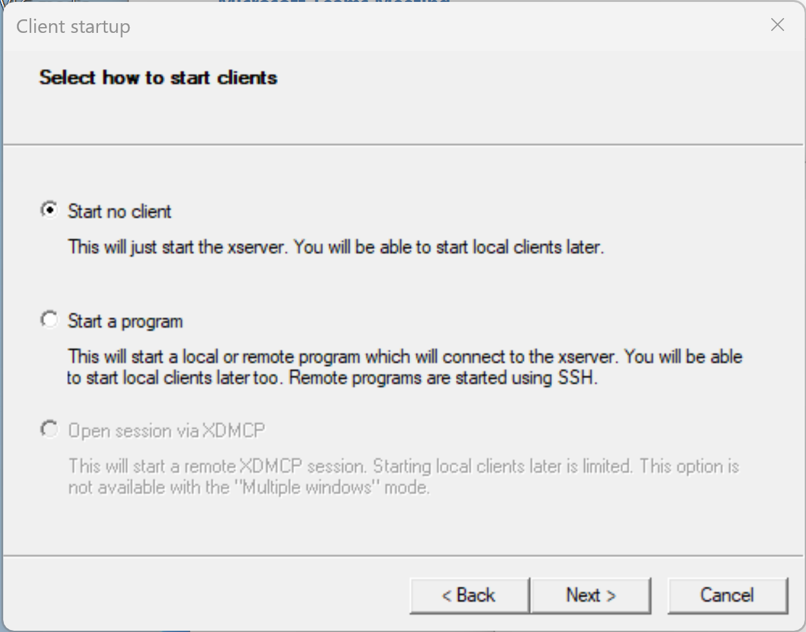
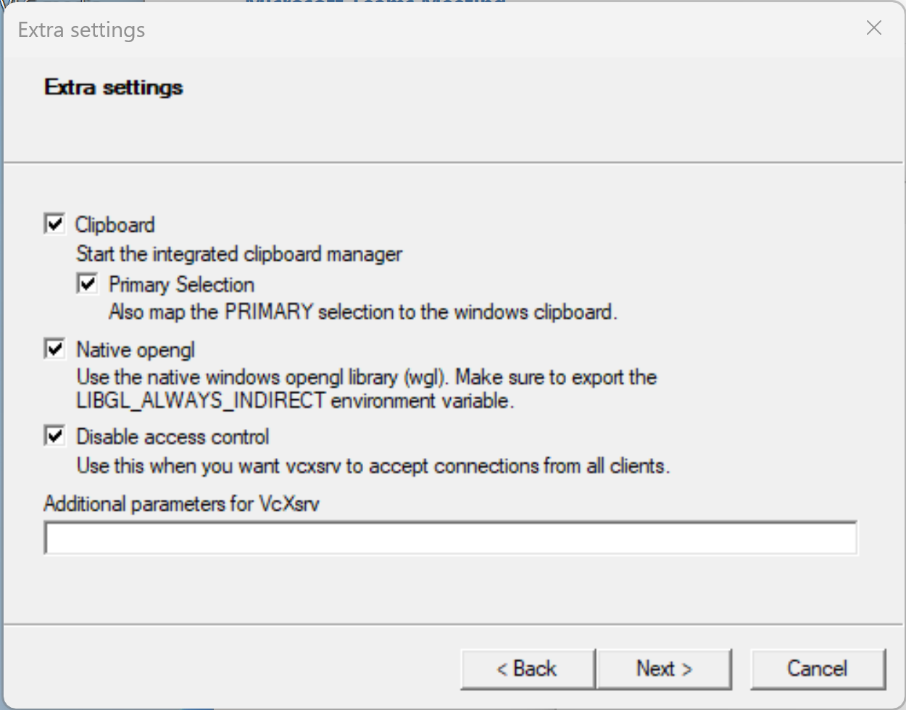
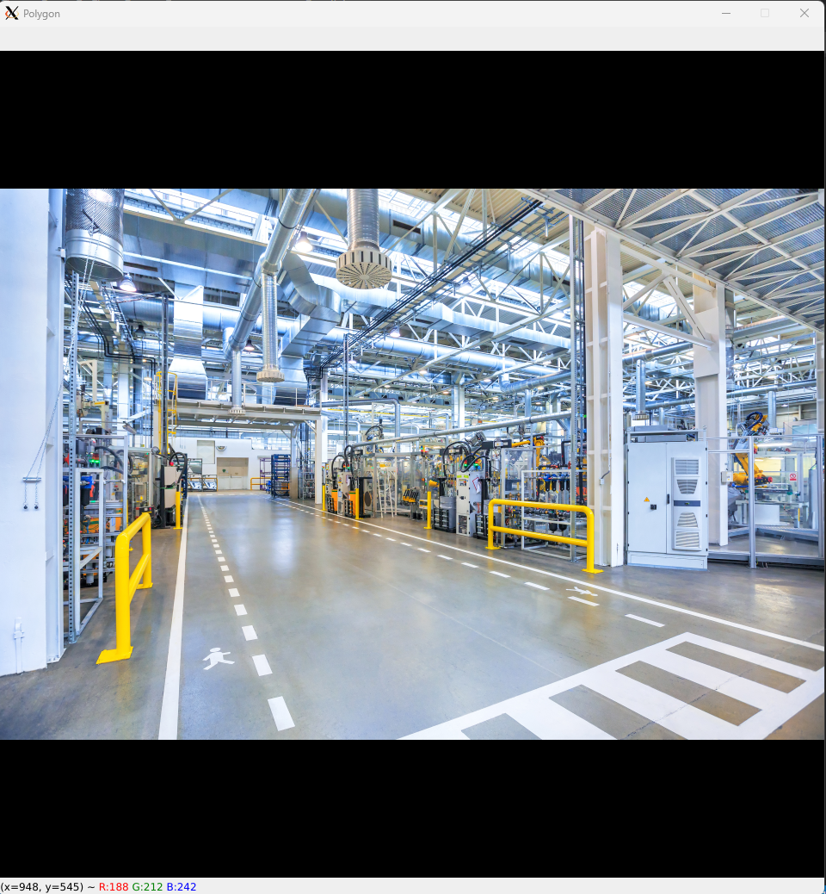
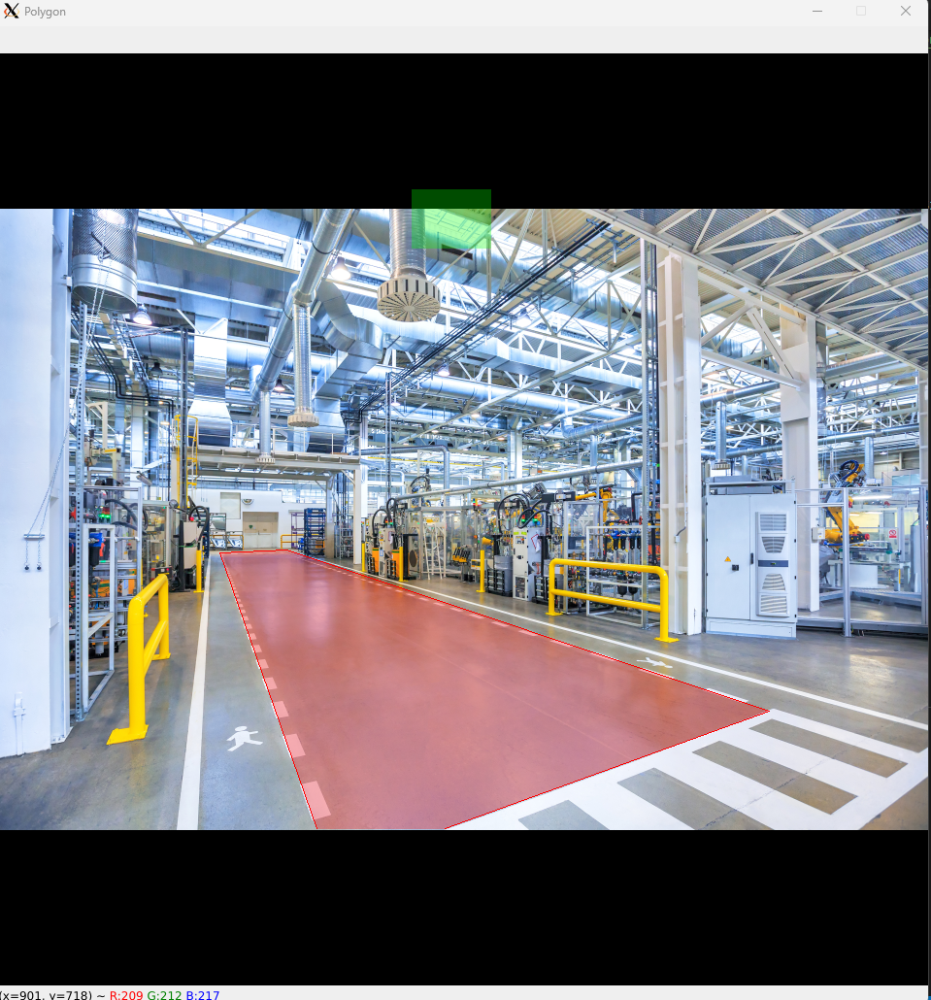
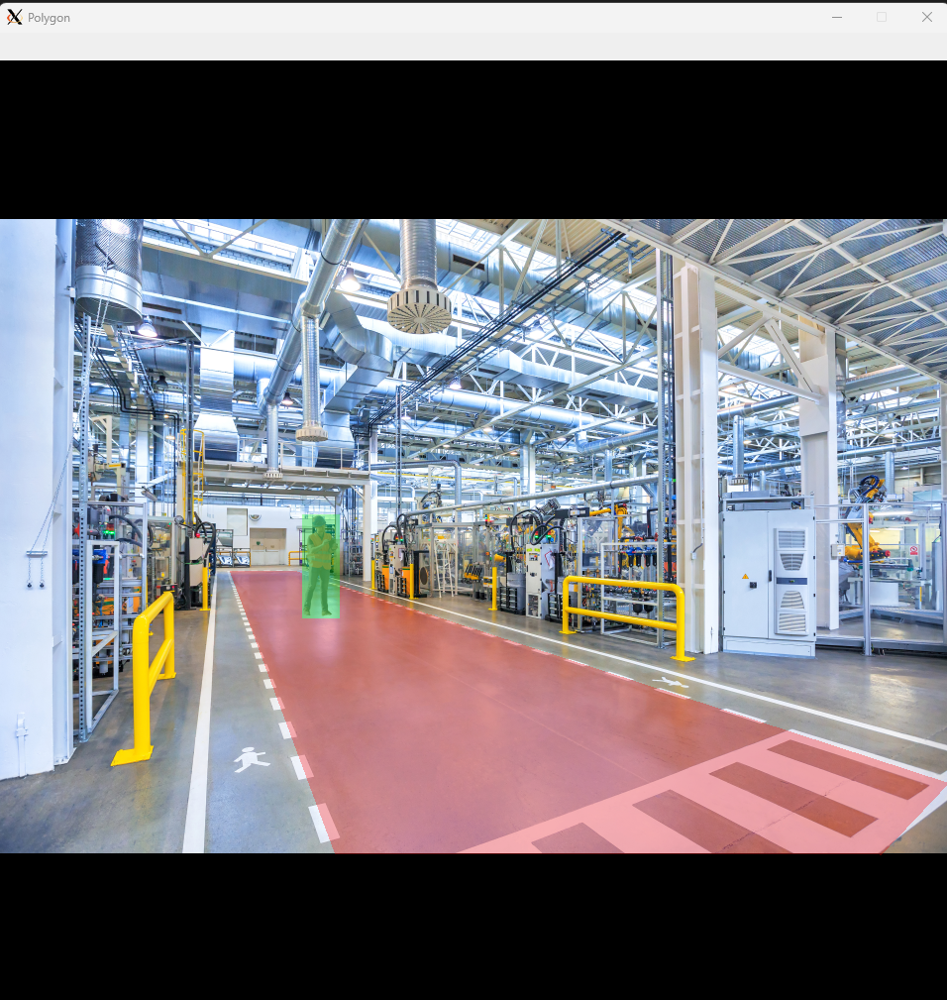

# Region-of-Interest-Coordinates-for-Image-Spatial-Analysis-
Instructions and Code sample to create coordinates for polygon to perform spatial analysis.

In researching the best means of establishing pixel coordinates for spatial imaga analytics using OpenCV, I came across a great little post/code snippet on StackOverflow (https://stackoverflow.com/questions/37099262/drawing-filled-polygon-using-mouse-events-in-open-cv-using-python) which I then modified to fit my use case. 

Essentially, my goal was to capture a video frame from a statically mounted camera, resize that frame according to my intended inference model dimensions and use the static coordinates as an evaluation element witnin my application.  To create the logic - in my case, whether or not the coordinates of a detected object break the boundary of the static coordinates - I employed the python 'shapely' library.

Shapely, I quickly discovered, does not have the greatest installation experience on Windows, so to I opted to install it on WSL2 (Ubuntu 20.04 LTS) on my Windows workstation.  To install, run:

sudo apt update 
sudo apt install python3-pip libgeos-dev
python3 -m pip install --upgrade pip
python3 -m pip install shapely opencv-contrib-python~=4.5.5 numpy>=1.19.0

Since there isn't GUI access built into Linux, I installed the VcXsrv x-server, after looking at several different options. https://sourceforge.net/projects/vcxsrv/ 

While there's no shortage of blogs on various WSL2/GUI installations, I found this post to be helpful regarding VcXsrv setup, including the setting the environment variable for the display in WSL2 https://aalonso.dev/blog/how-to-use-gui-apps-in-wsl2-forwarding-x-server-cdj  To set the env var, run 

sudo nano ~/.bashrc
(append the document with:)
export DISPLAY="`sed -n 's/nameserver //p' /etc/resolv.conf`:0" 

Lastly, I added the image resizing frame_preprocess.py file from the Manufacturing Vision Solution Accelerator, which can be set to your model dimension on line 15 of the boundary_config.py file.

To execute the code, start XLaunch:

Select 'Disable access control':

Save your configuration, or simply finish:

To run the script, open a command prompt, enter 'Ubuntu' if on Windows 11, or bash if on Windows 10 to get to your WSL2 installation. Now run: 

python3 <path to directory>/boundary_config.py

This will open a display window with the sample factory image (modified Adobe Stock photo) from the 'images' folder.  If you want to utilize your own frame capture, you can copy it into the 'images' folder and modify line 17 of the boundary_config.py.

To draw a polygon, click the left mouse button wherever you want to create a coordinate.  Once you've created the shape desired, click on the right mouse button twice to fill in the area. The coordinates for the drawn polygon will be shown in the terminal window.

In the modified image, I've added a worker inside of the forklift operation area, so if you create your coordinates around the person, you'll receive a message that the "Person is inside the work area" within the terminal.  The coordinates for the person are established on line 11 of the boundary_config.py file.

Within the Manufacturing Vision Solution Accelerators, I've also added the ability to add the ROI coordinates as a hard-coded variable (within the capture folder/file), along with code to intepret whether a detected object, such as a person, pet, equipment, etc. infringes on the boundary of the ROI.

Hope you find this useful to your vision analytics projects!